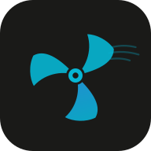

# W96P 控制

  

  
  
  
  
  
  

Witrn W96P / W66D 蓝牙风扇的网页控制面板。浏览器直连风扇，无需安装 App。

> ⚠️ **免责声明**：本项目为第三方开源工具，与 Witrn 官方无关。使用本项目操作设备可能影响设备正常运行，作者不对因使用本工具导致的设备损坏、数据丢失或其他损失承担责任。修改快充配置、进行固件升级等高级操作前，请确保了解相关风险。

## ✨ 功能

- 🎚️ **档位控制** — 1~4 档切换，支持自定义每档风速
- 🎯 **无级调速** — 滑块 0~100% 精确调节
- 🌬️ **自然风模式** — 模拟自然风，128 点曲线自由编辑
- ⏱️ **定时关机** — 1~480 分钟倒计时
- 📊 **实时数据** — 转速、电池电压/电流/容量、充电功率、电机状态
- ⚡ **电源管理** — 快充协议开关、C 口输入输出控制
- 📱 **PWA 安装** — 添加到手机/电脑桌面，离线可用

## 🚀 使用方法

1. 用 Chrome 或 Edge 打开 [w96p.gxb.pub](https://w96p.gxb.pub)
2. 点击「连接设备」，浏览器弹窗选择风扇
3. 开始控制

> ⚠️ 需要浏览器支持 Web Bluetooth，iOS Safari / Firefox 暂不支持。

## 🛠️ 技术架构

纯前端 Web 应用，无后端、无数据库。

- **框架** — React 19 + TypeScript + Vite 8
- **状态管理** — Zustand
- **通信** — Web Bluetooth API，直接通过浏览器与风扇 BLE GATT 通信
- **UI** — Tailwind CSS 4 + Recharts 图表 + react-grid-layout 可拖拽布局
- **离线** — PWA（Service Worker + Manifest），可安装到桌面
- **字体** — MiSans

## 📦 支持设备

| 型号 | 备注 |
|------|------|
| Witrn W96P | 主要支持 |
| Witrn W66D | 兼容 |

## 📄 License

MIT

> 📖 详细文档：
> - 数据流架构：[docs/ble-architecture.md](docs/ble-architecture.md)
> - BLE 协议参考：[docs/ble-protocol.md](docs/ble-protocol.md)
