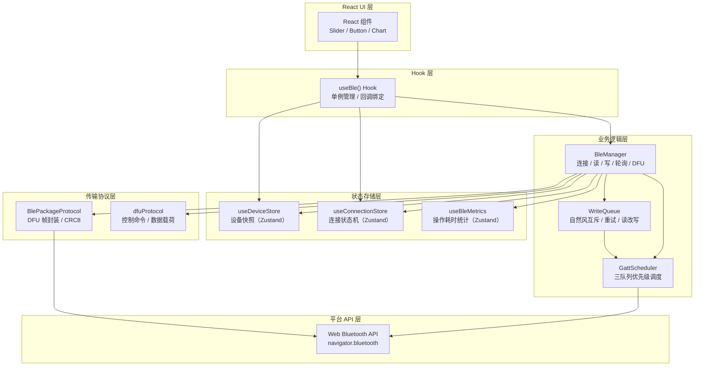
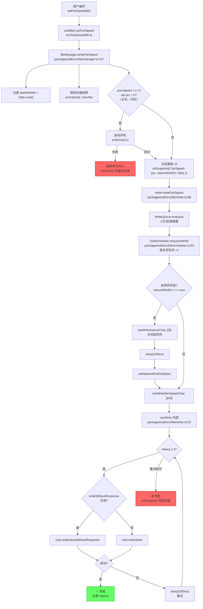
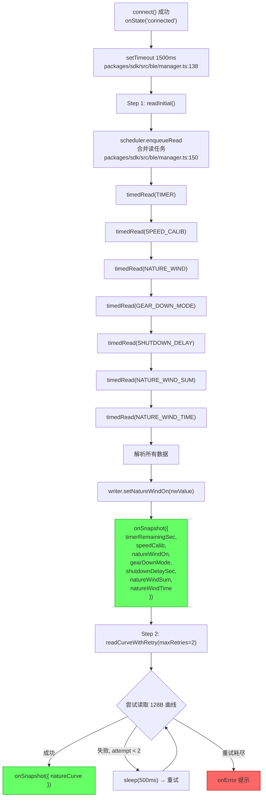
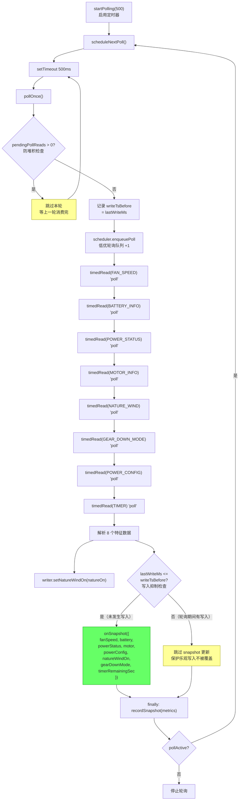
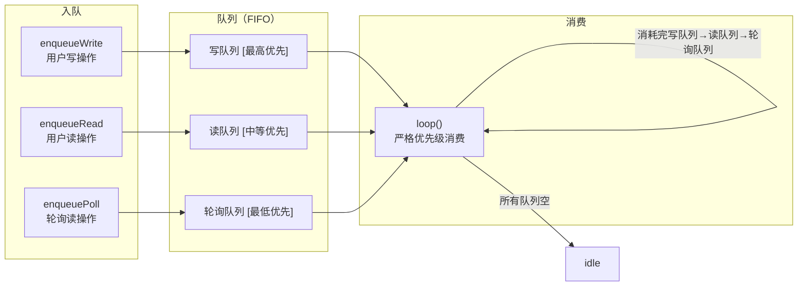
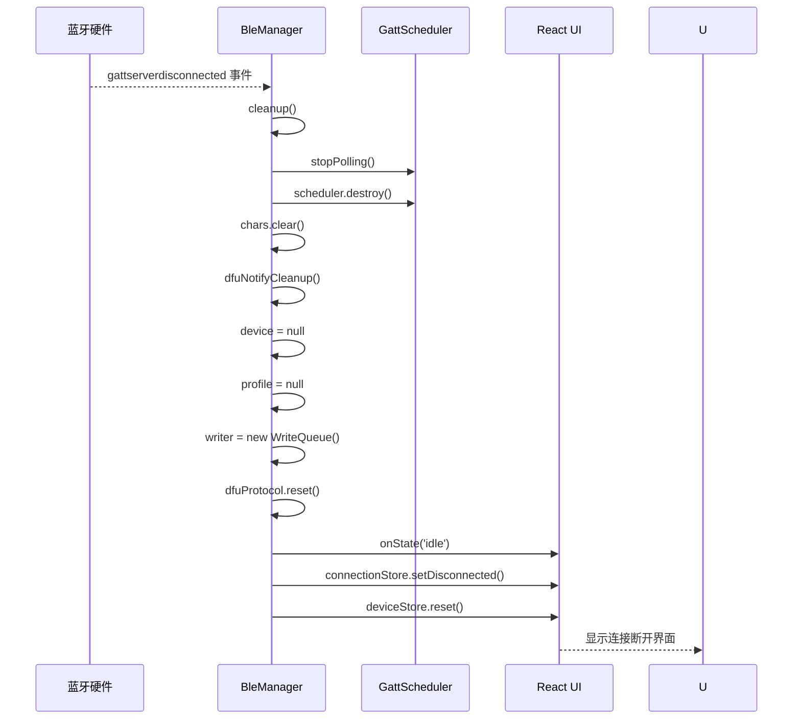
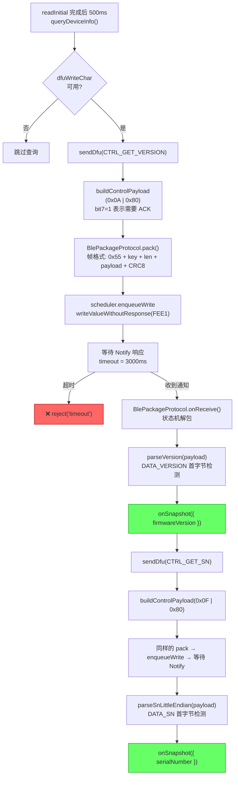
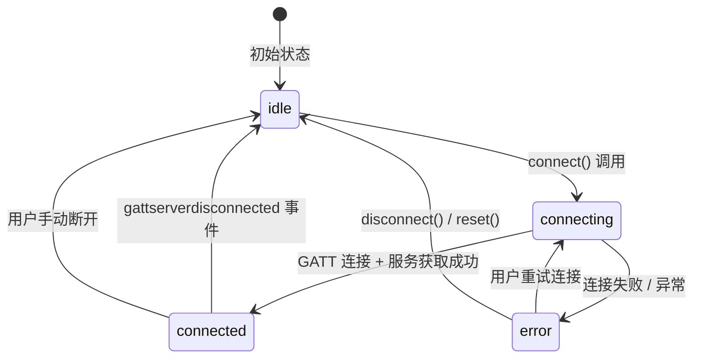

# 🔌 BLE 数据流架构

> 本文档详细描述 W96P 控制面板的蓝牙 BLE 通信架构，涵盖数据模型、读写路径、调度器、连接管理、DFU 查询和性能监控。面向需要深入理解或修改 BLE 通信层的开发者。

---

## 1. 整体分层架构

系统从用户操作到蓝牙硬件共分为 **六层**，每层职责清晰，互不越界：



**数据流向：**

- **写路径（UI → 硬件）：** `React UI → useBle → BleManager.write* → WriteQueue.enqueue → GattScheduler.enqueueWrite → rawWrite → Web Bluetooth`
- **读路径（硬件 → UI）：** `Web Bluetooth → timedRead → 解析器 → BleManager.onSnapshot → useDeviceStore.setSnapshot → React re-render`
- **连接状态路径：** `Web Bluetooth 事件 → BleManager.onState → useConnectionStore → React UI`

---

## 2. BleSnapshot 数据模型

所有读写操作共享一个扁平的部分更新快照。`BleManager` 通过 `onSnapshot` 回调将数据推送到 `useDeviceStore`，支持增量合并——只需发送变更的字段。

> **源码：** `packages/sdk/src/ble/types.ts`

### 2.1 接口定义

```typescript
// packages/sdk/src/ble/types.ts
export interface BleSnapshot {
  // ── 主控服务 FFF0 ──
  fanSpeed?: number;                           // 当前转速 0~100（根据型号限制）
  timerRemainingSec?: number;                  // 定时剩余秒数（uint16 BE）
  natureWindOn?: boolean;                      // 自然风开关
  natureWindSum?: number;                      // 自然风曲线有效点数（uint8）
  natureWindTime?: number;                     // 自然风累积运行时间秒数（uint32 BE）
  shutdownDelaySec?: number;                   // 蓝牙休眠延时秒数（uint16 BE）
  gearDownMode?: 0 | 1;                       // 减档模式：0=逐级降档，1=直接关停
  speedCalib?: [number, number, number, number]; // 1~4 档校准值

  // ── 自然风服务 FFE0 ──
  natureCurve?: number[];                      // 128 点自然风曲线，每字节 0~100

  // ── 电源服务 FFD0 ──
  battery?: BatteryInfo;                       // 电池信息（9 字段）
  powerStatus?: PowerStatus;                   // 电源状态（8 字段）
  motor?: MotorInfo;                           // 电机信息（3 字段）
  powerConfig?: PowerConfigRegs;               // 快充寄存器配置（12 字段）

  // ── DFU 服务 FEE0 ──
  serialNumber?: string;                       // 设备序列号（FEE0 查询）
  firmwareVersion?: string;                    // 固件版本号（FEE0 查询）
}
```

### 2.2 嵌套数据结构

```typescript
// packages/sdk/src/ble/parsers.ts

// 电池信息（BATTERY_INFO FFD1，30 字节读取）
export interface BatteryInfo {
  voltageMv: number;     // 电池电压 mV（uint16 BE, offset 0）
  currentMa: number;     // 电池电流 mA（int16 BE, offset 2, 正=充电）
  capacityMwh: number;   // 电池容量 mWh（uint32 BE, offset 4）
  chgMwh: number;        // 累计充电量 mWh（uint32 BE, offset 8）
  dchgMwh: number;       // 累计放电量 mWh（uint32 BE, offset 12）
  rcapMwh: number;       // 剩余容量 mWh（uint32 BE, offset 16）
  tempC: number;         // 电池温度 ℃（int16 BE, offset 20）
  chgTimeS: number;      // 累计充电时间秒（uint32 BE, offset 22）
  dchgTimeS: number;     // 累计放电时间秒（uint32 BE, offset 26）
}

// 电源状态（POWER_STATUS FFD2，≥11 字节读取）
export interface PowerStatus {
  vbusVmV: number;       // VBUS 电压 mV（uint32 BE, offset 0）
  vbusCurMa: number;     // VBUS 电流 mA（int16 BE, offset 4, 哨兵 0x7FFF=未接入）
  vbusConnected: boolean;// VBUS 是否接入（0x7FFF → false）
  powC: number;          // 电源类型（uint8, offset 6, 0=无, 1=C口输入, 2=C口输出）
  powSta: number;        // 充放电状态（uint8, offset 7, 0=停止, 1=充电中, 2=放电中）
  powCOut: boolean;      // C 口输出快充（uint8, offset 8, 0=使能）
  powCIn: boolean;       // C 口输入快充（uint8, offset 9, 0=使能）
  powCHi: boolean;       // C 口高压使能（uint8, offset 10, 0=使能）
}

// 电机信息（MOTOR_INFO FFD3）
export interface MotorInfo {
  currentMa: number;     // 电机电流 mA（uint16 BE, offset 0）
  block: boolean;        // 堵转标志（offset 2 & 0xf7 === 1）
  voltageMv: number;     // 电机电压 mV（末尾 2 字节 uint16 BE, >20000 置 0）
}

// 快充寄存器配置（POWER_CONFIG FFD4，16 字节读取）
export interface PowerConfigRegs {
  powLevel: number;      // offset 0
  powVer: number;        // 固件版本, offset 1
  powSink: number;       // 输入快充协议, offset 2
  powSrc: number;        // 输出快充协议, offset 3
  powCoreTemp: number;   // 核心温度, offset 4~5 int16 BE
  pow1A: number;         // 电压与协议支持, offset 6
  pow1C: number;         // PD/FCP Source/Sink, offset 7
  pow1D: number;         // AFC/FCP/SCP/SFCP, offset 8
  pow1E: number;         // QC Source, offset 9
  pow2A: number;         // PD 版本 + PPS1 电压, offset 13
  pow2B: number;         // Fix/PPS0/PPS1/重新广播, offset 14
  pow2C: number;         // 5V/9V/12V PDO 电流, offset 15
}
```

### 2.3 状态存储与合并策略

```typescript
// packages/sdk/src/stores/device.ts
export const useDeviceStore = create<DeviceState>()(
  subscribeWithSelector((set) => ({
    fanSpeed: 0,
    timerRemainingSec: 0,
    natureWindOn: false,
    natureWindSum: 0,
    natureWindTime: 0,
    shutdownDelaySec: 0,
    gearDownMode: 0 as 0 | 1,
    speedCalib: [30, 50, 70, 100] as [number, number, number, number],
    natureCurve: [] as number[],
    natureCurveReadAt: null as number | null,
    battery: null,
    powerStatus: null,
    motor: null,
    powerConfig: null,
    serialNumber: null,
    firmwareVersion: null,

    setSnapshot: (snap) => set((state) => {
      const next: Partial<DeviceState> = { ...state };
      // 扁平字段直接覆盖
      for (const key of Object.keys(snap) as (keyof BleSnapshot)[]) {
        if (key === 'battery' || key === 'powerStatus'
            || key === 'motor' || key === 'powerConfig') continue;
        (next as any)[key] = (snap as any)[key];
      }
      // 嵌套对象浅合并（支持乐观更新的部分字段）
      if (snap.battery && state.battery)
        next.battery = { ...state.battery, ...snap.battery };
      else if (snap.battery !== undefined) next.battery = snap.battery;
      // ... 同理处理 powerStatus / motor / powerConfig
      return next as DeviceState;
    }),
  })),
);
```

> **关键设计：** `setSnapshot` 支持扁平字段直接替换和嵌套对象的浅合并。乐观写入只传递变更的嵌套字段（如 `{ battery: { capacityMwh: 18000 } }`），与现有 state 合并而不是整体覆盖。

---

## 3. 写路径

### 3.1 完整流程图



### 3.2 写入类型详解

所有写入方法遵循统一的 **乐观更新 → 调度器入队 → 重试 → 失败回滚** 模式：

```typescript
// packages/sdk/src/ble/manager.ts（以 writeTimer 为例）
async writeTimer(sec: number): Promise<void> {
  this.lastWriteMs = Date.now();                    // ❶ 记录写入时间戳
  const prev = useDeviceStore.getState().timerRemainingSec; // ❷ 保存旧值
  this.onSnapshot?.({ timerRemainingSec: sec });    // ❸ 乐观更新 UI

  try {
    const char = this.chars.get(CHARS.TIMER)!;
    const data = new Uint8Array([(sec >> 8) & 0xff, sec & 0xff]);
    await this.writer.enqueue(async () => {          // ❹ 入队
      await this.writer.rawWrite(char, data);        // ❺ 带重试写入
    });
  } catch (e) {
    console.log('[BLE] writeTimer 失败:', e);
    this.onSnapshot?.({ timerRemainingSec: prev });  // ❻ 失败回滚
  }
}
```

| 写方法 | 特征 | 数据格式 | 特殊处理 |
|--------|------|----------|----------|
| `writeGear(gear)` | POWER (FFF1) | 1B `[gear]` | 自然风互斥（关自然风→sleep 100ms→写档位） |
| `writeFanSpeed(pct)` | FAN_SPEED (FFF3) | 1B `[pct]` | 自然风互斥 + 自动开机检测 |
| `writeNatureWind(on)` | NATURE_WIND (FFF4) | 1B `[0/1]` | 同步更新 `writer.natureWindOn` |
| `writeTimer(sec)` | TIMER (FFF2) | 2B uint16 BE | — |
| `writeShutdownDelay(sec)` | SHUTDOWN_DELAY (FFF5) | 2B uint16 BE | 1~9s 自动修正为 10s |
| `writeGearDownMode(mode)` | GEAR_DOWN_MODE (FFF6) | 1B `[mode]` | — |
| `writeSpeedCalib(speeds)` | SPEED_CALIB (FFF7) | 4B `[s1,s2,s3,s4]` | — |
| `writeTurbo(on)` | TURBO_MODE (FFFC) | 1B `[0/1]` | v1.3+，v1.6+ 由 FFF9 改为 FFFC，关机自动开 1 档 |
| `writeTurboTime(sec)` | TURBO_TIME (FFF8) | 1B or 2B uint16 BE | v1.3=1B(1-199), v1.5+=2B(1-600) |
| `writeLight(v)` | LIGHT (FFFA) | 1B `[v]` | v1.3+ 灯光亮度 (0=关, 1~4=低~最高) |
| `writeBleName(name)` | BLE_NAME (FFC1) | UTF-8 string, ≤17B | v1.3+，v1.5 废弃 |
| `readTurbo()` | TURBO_MODE (FFFC) | 1B | v1.3+，v1.6+ 由 FFF9 改为 FFFC 读取 Turbo 状态 |
| `readTurboCountdown()` | TURBO_COUNTDOWN (FFFB) | 2B uint16 BE | v1.5+ 读取剩余秒数 |
| `readTurboTime()` | TURBO_TIME (FFF8) | 1B or 2B | 读取已设置的 Turbo 时间 |
| `writeNatureCurve(128pts)` | NATURE_CURVE (FFE3) | 128B | 校验长度必须为 128 |
| `writeBatteryCapacity(mah, v)` | BATTERY_INFO (FFD1) | ASCII `BAT_CAP=mwh,` | mwh=mah×v |
| `writePowCOut(enable)` | POWER_STATUS (FFD2) | ASCII `POW_C_OUT=0/1,` | 0=使能 |
| `writePowCIn(enable)` | POWER_STATUS (FFD2) | ASCII `POW_C_IN=0/1,` | 0=使能 |
| `writePowCHi(enable)` | POWER_STATUS (FFD2) | ASCII `POW_C_HI=0/1,` | 0=使能 |
| `writeNatureWindCtrl(op)` | NATURE_WIND_CTRL (FFE4) | 1B `[1/2]` | 1=保存配置, 2=恢复默认 |
| `writeBatteryClr()` | BATTERY_INFO (FFD1) | ASCII `BAT_CLR=0,` | 清除电池统计 |
| `writePowerClr()` | POWER_STATUS (FFD2) | ASCII `POW_CLR=0,` | 清除电源统计 |
| `writePowSwitch(reg, bit, en, inv)` | POWER_CONFIG (FFD4) | 读-改-写 | 位域操作 |
| `writePowRegister(reg, byte)` | POWER_CONFIG (FFD4) | ASCII `POW_XX=byte,` | 寄存器整体写入 |

### 3.3 rawWrite 重试机制

```typescript
// packages/sdk/src/ble/writer.ts:52-86
async rawWrite(
  char: BluetoothRemoteGATTCharacteristic,
  data: Uint8Array,
  retries = 3,       // 默认 3 次重试
): Promise<void> {
  const t0 = performance.now();
  for (let i = 0; i < retries; i++) {
    try {
      // 优先使用无响应写入（速度快，不阻塞）
      if (char.properties.writeWithoutResponse) {
        await char.writeValueWithoutResponse(data as BufferSource);
      } else {
        await char.writeValue(data as BufferSource);
      }
      // 成功：记录 metrics 并返回
      useBleMetrics.getState().recordOp({
        ts: t0, type: 'write', charId, size: data.length,
        duration: Math.round(performance.now() - t0),
      });
      return;
    } catch (e) {
      if (i === retries - 1) {
        // 最后一次重试也失败，记录错误 metrics 并抛出
        useBleMetrics.getState().recordOp({ /* ...error... */ });
        throw e;
      }
      await sleep(200);  // 重试前等待 200ms
    }
  }
}
```

**重试参数：** 最多 3 次，间隔 200ms。全部失败后抛出异常，由上层 `writeFanSpeed` / `writeGear` 等捕获并回滚。

### 3.4 自然风互斥机制

自然风与手动调速/调档互斥，由 **WriteQueue** 在写入前自动处理：

```typescript
// packages/sdk/src/ble/writer.ts:88-100 — writeFanSpeed
async writeFanSpeed(char: BluetoothRemoteGATTCharacteristic, pct: number): Promise<void> {
  await this.enqueue(async () => {
    // ❶ 检查自然风是否开启
    if (this.natureWindOn && this._natureChar) {
      // ❷ 关闭自然风
      await this.rawWrite(this._natureChar, new Uint8Array([0]));
      await sleep(100);           // ❸ 等待 100ms 让硬件处理
      this.natureWindOn = false;  // ❹ 更新本地状态
    }
    // ❺ 写入目标转速
    await this.rawWrite(char, new Uint8Array([pct]));
  });
}

// packages/sdk/src/ble/manager.ts:393-415 — writeGear 同理
async writeGear(gear: 0 | 1 | 2 | 3 | 4): Promise<void> {
  // ... 乐观更新 ...
  await this.writer.enqueue(async () => {
    // 如果自然风开启且非关机操作
    if (this.writer.isNatureWindOn() && this.writer.natureChar && gear !== 0) {
      await this.writer.rawWrite(this.writer.natureChar, new Uint8Array([0]));
      await sleep(100);
      this.writer.setNatureWindOn(false);
    }
    await this.writer.rawWrite(char, new Uint8Array([gear]));
  });
}
```

> **关键：** 互斥检查、关闭自然风、写入目标值在同一个 `enqueue` 闭包内原子执行，调度器保证不会被其他任务打断。

### 3.5 电源寄存器读-改-写

快充配置寄存器写入需要先读取当前值，修改特定位，再整体写回：

```typescript
// packages/sdk/src/ble/writer.ts:102-115
async writeRegisterBit(
  reg: PowReg,       // '1A' | '1C' | '1D' | '1E' | '2A' | '2B' | '2C'
  bit: number,       // 位号 0~7
  value: boolean,    // 目标值
): Promise<void> {
  if (!this.regChar) throw new Error('regChar 未设置');
  await this.enqueue(async () => {
    // ❶ 读取当前寄存器值
    const curBuf = await this.regChar!.readValue();
    const cur = new DataView(curBuf.buffer).getUint8(0);
    // ❷ 掩码修改目标位
    const mask = 1 << bit;
    const next = value ? (cur | mask) : (cur & ~mask);
    // ❸ 整体写回（ASCII 命令）
    await this.rawWrite(this.regChar!, encodeCmd(cmd.setRegister(reg, next)));
  });
}
```

> **注意：** 整个 `readValue → mask → rawWrite` 在同一个 `enqueue` 闭包内，避免并发读取同一寄存器导致数据竞争。

### 3.6 自动开机（临时行为）

```typescript
// packages/sdk/src/ble/manager.ts:417-443
async writeFanSpeed(pct: number): Promise<void> {
  this.lastWriteMs = Date.now();
  const prevSpeed = useDeviceStore.getState().fanSpeed;
  const prevNw = useDeviceStore.getState().natureWindOn;

  // 风扇关机时调转速，先自动开机到 1 档
  if (prevSpeed === 0 && pct > 0) {
    try {
      console.log('[BLE] 未开机, 先手动开机');
      await this.writeGear(1);   // writeGear 内部已做乐观更新+回滚
    } catch {
      return;  // 开机失败，放弃后续写入
    }
  }

  // 继续执行正常调速逻辑 ...
}
```

> **逻辑：** 当检测到当前转速为 0（关机）且目标转速 > 0 时，先调用 `writeGear(1)` 开 1 档。如果开机失败（`writeGear` 的乐观更新已被内部回滚），直接 `return` 放弃后续调速，避免数据不一致。

---

## 4. 读路径

### 4.1 readInitial — 初始读取

连接建立后 **1.5 秒** 触发，分为两个步骤：



**7 个特征合并读取：**

```typescript
// packages/sdk/src/ble/manager.ts:146-185
private async readInitial(): Promise<void> {
  if (!this.profile) return;

  try {
    // 合并为一个 enqueueRead 任务，调度器原子执行
    await this.scheduler.enqueueRead(async () => {
      const timer = await this.timedRead(CHARS.TIMER);           // FFF2
      const calib = await this.timedRead(CHARS.SPEED_CALIB);     // FFF7
      const nw = await this.timedRead(CHARS.NATURE_WIND);        // FFF4
      const gdm = await this.timedRead(CHARS.GEAR_DOWN_MODE);    // FFF6
      const sd = await this.timedRead(CHARS.SHUTDOWN_DELAY);     // FFF5
      const nwSum = await this.timedRead(CHARS.NATURE_WIND_SUM); // FFE1
      const nwTime = await this.timedRead(CHARS.NATURE_WIND_TIME); // FFE2

      this.writer.setNatureWindOn(u8(nwDv) === 1);
      this.onSnapshot?.({
        timerRemainingSec: u16be(timerDv),
        speedCalib: [u8(calibDv,0), u8(calibDv,1), u8(calibDv,2), u8(calibDv,3)],
        natureWindOn: u8(nwDv) === 1,
        gearDownMode: u8(gdmDv) as 0 | 1,
        shutdownDelaySec: u16be(sdDv),
        natureWindSum: u8(nwSum),
        natureWindTime: new DataView(nwTime.buffer).getUint32(0, false),
      });
    });
  } catch (e) {
    this.onError?.(String(e instanceof Error ? e.message : e));
    return;
  }
  // Step 2: 读自然风曲线（独立任务，支持重试）
  await this.readCurveWithRetry();
}
```

**曲线重试逻辑：**

```typescript
// packages/sdk/src/ble/manager.ts:188-209
private async readCurveWithRetry(maxRetries = 2): Promise<void> {
  for (let attempt = 0; attempt <= maxRetries; attempt++) {
    try {
      await this.scheduler.enqueueRead(async () => {
        const v = await this.timedRead(CHARS.NATURE_CURVE);
        const pts: number[] = [];
        for (let i = 0; i < v.byteLength; i++) pts.push(u8(v, i));
        this.onSnapshot?.({ natureCurve: pts });
      });
      return;  // 成功则退出
    } catch (e) {
      if (attempt < maxRetries) {
        await sleep(500);  // 失败等待 500ms 重试
      } else {
        this.onError?.(String(e instanceof Error ? e.message : e));
      }
    }
  }
}
```

> **为什么单独重试？** NATURE_CURVE 特征为 128 字节，Web Bluetooth 会将其分片为约 7 个 GATT 片段传输。长数据 + 多片段 = 更高的 GATT 超时概率，因此额外提供 2 次重试机会。

### 4.2 pollOnce — 轮询读取

连接稳定后每 **500ms**（可配置）触发一次，读取 8 个特征：



**写入抑制机制：**

```typescript
// packages/sdk/src/ble/manager.ts:301-354
private async pollOnce(): Promise<void> {
  if (!this.profile) return;

  // ❶ 防堆积：上一轮尚未消费完则跳过
  if (this.scheduler.pendingPollReads > 0) return;

  // ❷ 记录本轮开始前的最后写入时间
  const writeTsBefore = this.lastWriteMs;

  try {
    await this.scheduler.enqueuePoll(async () => {
      // 串行读取 8 个特征 ...
      const speed = await this.timedRead(CHARS.FAN_SPEED, 'poll');
      const bat   = await this.timedRead(CHARS.BATTERY_INFO, 'poll');
      const pwr   = await this.timedRead(CHARS.POWER_STATUS, 'poll');
      const mot   = await this.timedRead(CHARS.MOTOR_INFO, 'poll');
      const nw    = await this.timedRead(CHARS.NATURE_WIND, 'poll');
      const gdm   = await this.timedRead(CHARS.GEAR_DOWN_MODE, 'poll');
      const pc    = await this.timedRead(CHARS.POWER_CONFIG, 'poll');
      const timer = await this.timedRead(CHARS.TIMER, 'poll');

      // ❸ 写入抑制：如果本轮内发生写入，跳过快照推送
      if (this.lastWriteMs <= writeTsBefore) {
        this.onSnapshot?.({
          fanSpeed: u8(speedDv),
          battery: parseBatteryInfo(batDv),
          powerStatus: parsePowerStatus(pwrDv),
          motor: parseMotorInfo(motDv, this.profile!),
          powerConfig: parsePowerConfig(pcDv),
          natureWindOn: natureOn,
          gearDownMode: u8(gdmDv) as 0 | 1,
          timerRemainingSec: u16be(timerDv),
        });
      }
    });
  } catch (e) {
    this.onError?.(String(e instanceof Error ? e.message : e));
  } finally {
    // ❹ 记录本轮调度器状态快照
    useBleMetrics.getState().recordSnapshot({
      ts: performance.now(),
      ...this.scheduler.getStats(),
    });
    // ❺ 递归调度下一轮
    if (this.pollActive) this.scheduleNextPoll();
  }
}
```

**两个关键保护机制：**

| 机制 | 作用 | 实现 |
|------|------|------|
| **防堆积** | 上一轮 poll 任务还在队列中时跳过本轮 | `scheduler.pendingPollReads > 0` → return |
| **写入抑制** | 轮询期间发起了写操作，抛弃本轮读数据 | `lastWriteMs <= writeTsBefore` 才推送 snapshot |

> **为什么需要写入抑制？** 乐观更新先将新值通过 `onSnapshot` 推送到 UI，同时 GATT 写入走调度器高优队列。如果写入期间轮询任务也完成了读取（低优队列排在后面），轮询回来的值可能是写入前的旧值，会覆盖乐观更新的结果。通过比较 `lastWriteMs` 和 `writeTsBefore`，本轮启动后若有任何写入，丢弃轮询数据，保护乐观更新不被覆盖。

### 4.3 timedRead — 指标收集

所有 `char.readValue()` 调用都通过 `timedRead` 包装，自动记录操作耗时：

```typescript
// packages/sdk/src/ble/manager.ts:34-52
private async timedRead(
  uuid: string,
  opType: OpRecord['type'] = 'read',  // 'read' | 'poll'
): Promise<DataView> {
  const t0 = performance.now();
  const charId = uuid.slice(4, 8);     // 提取短 UUID：fff1/ffd1/...
  try {
    const v = await this.chars.get(uuid)!.readValue();
    useBleMetrics.getState().recordOp({
      ts: t0, type: opType, charId,
      size: v.byteLength,
      duration: Math.round(performance.now() - t0),
    });
    return new DataView(v.buffer);
  } catch (e) {
    useBleMetrics.getState().recordOp({
      ts: t0, type: opType, charId, size: 0,
      duration: Math.round(performance.now() - t0),
      error: String(e instanceof Error ? e.message : e),
    });
    throw e;  // 继续向上传播异常
  }
}
```

> **记录维度：** 时间戳、操作类型（read/write/poll）、特征短 ID、字节数、耗时 ms、错误信息。

---

## 5. GattScheduler 三队列调度器

### 5.1 设计原理

Web Bluetooth API 要求同一设备上的所有 GATT 操作必须串行化，否则会抛出 `"GATT operation already in progress"` 错误。`GattScheduler` 将不同类型请求分为三个优先级队列，全部串行消费：



> **源码：** `packages/sdk/src/ble/scheduler.ts`

### 5.2 核心数据结构

```typescript
// packages/sdk/src/ble/scheduler.ts
export class GattScheduler {
  private writeQueue: GattTask[] = [];  // 高优先：用户写
  private readQueue: GattTask[] = [];   // 中优先：用户读
  private pollQueue: GattTask[] = [];   // 低优先：轮询读
  private running = false;              // 是否正在执行任务
  private currentTask: 'idle' | 'write' | 'read' | 'poll' = 'idle';
}
```

### 5.3 提交接口

```typescript
/** 提交用户写任务（最高优先） */
enqueueWrite<T>(task: GattTask<T>): Promise<T> {
  return new Promise<T>((resolve, reject) => {
    this.writeQueue.push(async () => {
      try { resolve(await task()); }
      catch (e) { reject(e); }
    });
    console.log(`[调度器] +写 | ${this.stateSummary()}`);
    this.kick();  // 尝试启动消费循环
  });
}

/** 提交用户读任务（中优先） */
enqueueRead<T>(task: GattTask<T>): Promise<T> {
  // ... 入读队列 ...
  this.kick();
}

/** 提交轮询读任务（最低优先） */
enqueuePoll<T>(task: GattTask<T>): Promise<T> {
  // ... 入轮询队列 ...
  this.kick();
}
```

### 5.4 消费循环

```typescript
// packages/sdk/src/ble/scheduler.ts:114-141
private async loop(): Promise<void> {
  while (true) {
    let source: SchedulerStats['current'] = 'idle';
    let task = this.writeQueue.shift();    // ❶ 先消费写队列
    if (task) {
      source = 'write';
    } else {
      task = this.readQueue.shift();       // ❷ 再消费读队列
      if (task) {
        source = 'read';
      } else {
        task = this.pollQueue.shift();     // ❸ 最后消费轮询队列
        if (task) source = 'poll';
      }
    }
    if (!task) break;  // 所有队列空，进入 idle

    this.currentTask = source;
    useBleMetrics.getState().setSchedulerState(source);

    const label = source === 'write' ? '写'
      : source === 'read' ? '读' : '轮询';
    console.log(`[调度器] 执行 ${label} | 剩余 ${this.stateSummary()}`);
    await task();  // ❹ 等待任务完成（包括任务内所有子操作）
  }
  this.currentTask = 'idle';
  this.running = false;
  useBleMetrics.getState().setSchedulerState('idle');
}
```

### 5.5 状态监控

```typescript
/** 当前待处理的轮询读任务数（外部用于防堆积判断） */
get pendingPollReads(): number {
  return this.pollQueue.length;
}

/** 获取调度器快照 */
getStats(): SchedulerStats {
  return {
    write: this.writeQueue.length,
    read: this.readQueue.length,
    poll: this.pollQueue.length,
    active: this.running,
    current: this.running ? this.currentTask : 'idle',
  };
}
```

### 5.6 销毁

```typescript
destroy(): void {
  console.log(`[调度器] 销毁, 丢弃: 写×${w} 读×${r} 轮询×${p}`);
  this.writeQueue.length = 0;
  this.readQueue.length = 0;
  this.pollQueue.length = 0;
  this.running = false;
}
```

> **注意：** `destroy()` 直接清空所有队列而不执行剩余任务。丢弃的 Promise 不会 resolve/reject，可能导致调用方挂起。`BleManager.cleanup()` 在 `destroy()` 之后创建全新的 `WriteQueue` 实例并调用 `reset()`，确保重连时不会有残留状态。

### 5.7 调度器与 WriteQueue 的绑定

```typescript
// packages/sdk/src/ble/manager.ts:54-56（构造函数）
constructor() {
  this.writer.bindScheduler(this.scheduler);
}

// connect() 开头强制重建
async connect(): Promise<void> {
  this.scheduler = new GattScheduler('BLE');
  this.writer.bindScheduler(this.scheduler);
  // ...
}

// packages/sdk/src/ble/writer.ts:38-49
enqueue<T>(task: () => Promise<T>): Promise<T> {
  if (!this.scheduler) throw new Error('WriteQueue: scheduler 未绑定');
  return new Promise<T>((resolve, reject) => {
    this.scheduler!.enqueueWrite(async () => {
      try { resolve(await task()); }
      catch (e) { reject(e); }
    });
  });
}
```

> **关键：** `connect()` 开头强制创建新的 `GattScheduler` 并重新绑定。这是为了处理重连场景——上一次 `cleanup()` 可能已销毁旧调度器并创建了新的空 `WriteQueue`（`this.writer = new WriteQueue()`），需要重新建立绑定关系。

---

## 6. 连接完整时序

```mermaid
sequenceDiagram
    actor U as 用户
    participant UI as React UI
    participant HOOK as useBle Hook
    participant MGR as BleManager
    participant SCH as GattScheduler
    participant WQ as WriteQueue
    participant BLE as 蓝牙硬件

    U->>UI: 点击「连接设备」
    UI->>HOOK: connectReal()

    rect rgb(20,30,50)
        Note over HOOK,MGR: 阶段 1：建立连接
        HOOK->>MGR: new BleManager() + bindCallbacks()
        HOOK->>MGR: connect()
        MGR->>MGR: new GattScheduler()<br/>writer.bindScheduler()
        MGR->>MGR: onState('connecting')
        MGR->>MGR: connectionStore.setConnecting()
        MGR->>BLE: requestDevice({ filters: [FFF0] })
        BLE-->>MGR: BluetoothDevice
        MGR->>BLE: gatt.connect()
        BLE-->>MGR: 连接成功
        MGR->>BLE: getPrimaryService(FFF0)
        MGR->>BLE: getPrimaryService(FFD0)
        MGR->>BLE: getPrimaryService(FFE0)
        BLE-->>MGR: 3 个主服务

        loop 15 个特征
            MGR->>BLE: getCharacteristic(UUID)
            BLE-->>MGR: GATTCharacteristic
        end

        opt DFU 服务可用
            MGR->>BLE: getPrimaryServices(FEE0)
            BLE-->>MGR: DFU 服务
            MGR->>BLE: startNotifications(FEE2)
            BLE-->>MGR: Notify 就绪
        end

        MGR->>MGR: pickProfile(deviceName)
        MGR->>MGR: writer.setNatureWindChar()
        MGR->>MGR: writer.setRegChar()
        MGR->>UI: onState('connected')
        MGR->>UI: connectionStore.setConnected(name, profile)
        UI-->>U: 显示主控制界面
    end

    rect rgb(30,40,20)
        Note over MGR,BLE: 阶段 2：初始读取（+1.5s）
        MGR->>MGR: setTimeout 1500ms
        MGR->>SCH: enqueueRead(7 特征合并任务)
        Note over SCH: 读队列 +1

        SCH->>BLE: timedRead(TIMER)
        BLE-->>SCH: 2B
        SCH->>BLE: timedRead(SPEED_CALIB)
        BLE-->>SCH: 4B
        SCH->>BLE: timedRead(NATURE_WIND)
        BLE-->>SCH: 1B
        SCH->>BLE: timedRead(GEAR_DOWN_MODE)
        BLE-->>SCH: 1B
        SCH->>BLE: timedRead(SHUTDOWN_DELAY)
        BLE-->>SCH: 2B
        SCH->>BLE: timedRead(NATURE_WIND_SUM)
        BLE-->>SCH: 1B
        SCH->>BLE: timedRead(NATURE_WIND_TIME)
        BLE-->>SCH: 4B

        SCH-->>MGR: 解析完成
        MGR->>UI: onSnapshot(初始状态)
        UI-->>U: 显示当前风扇状态

        MGR->>SCH: readCurveWithRetry(2 次)
        SCH->>BLE: timedRead(NATURE_CURVE 128B)
        BLE-->>SCH: 128B（约 7 个 GATT 片段）
        SCH-->>MGR: 曲线数据
        MGR->>UI: onSnapshot({ natureCurve })
    end

    rect rgb(50,30,20)
        Note over MGR,BLE: 阶段 3：设备信息查询（+2.0s）
        MGR->>SCH: sendDfu(GET_VERSION)
        Note over SCH: 写队列 +1
        SCH->>BLE: writeValueWithoutResponse(FEE1)
        BLE-->>MGR: Notify → BlePackageProtocol 解包
        MGR->>UI: onSnapshot({ firmwareVersion })

        MGR->>SCH: sendDfu(GET_SN)
        SCH->>BLE: writeValueWithoutResponse(FEE1)
        BLE-->>MGR: Notify → 解包
        MGR->>UI: onSnapshot({ serialNumber })
    end

    rect rgb(30,30,30)
        Note over MGR,BLE: 阶段 4：稳态轮询（每 500ms）
        loop 每 500ms
            MGR->>SCH: enqueuePoll(8 特征)
            Note over SCH: 轮询队列 +1<br/>pendingPollReads > 0 时跳过
            SCH->>BLE: timedRead × 8 (poll)
            BLE-->>SCH: 数据
            SCH-->>MGR: 解析 + 写入抑制检查
            MGR->>UI: onSnapshot(实时数据)
            MGR->>MGR: recordSnapshot(metrics)
            MGR->>MGR: scheduleNextPoll()
        end
    end
```



### 6.1 断开流程



---

## 7. DFU 查询流程

### 7.1 查询序列号和固件版本

DFU 查询使用专用通信协议（`BlePackageProtocol` 封装的帧格式 + 控制命令）。查询在初始读取后 **2.0 秒** 触发：



### 7.2 sendDfu 实现

```typescript
// packages/sdk/src/ble/manager.ts:245-275
private sendDfu(payload: Uint8Array, timeoutMs = 3000): Promise<Uint8Array> {
  return new Promise<Uint8Array>((resolve, reject) => {
    if (!this.dfuWriteChar) {
      reject(new Error('DFU not available'));
      return;
    }

    const timeout = setTimeout(() => {
      this.dfuPendingResolve = null;
      reject(new Error(`DFU query timeout after ${timeoutMs}ms`));
    }, timeoutMs);

    // 设置一次性的响应处理器
    this.dfuPendingResolve = (data: Uint8Array) => {
      clearTimeout(timeout);
      resolve(data);
    };

    // 封包并写入
    const frame = this.dfuProtocol.pack(payload);
    this.scheduler.enqueueWrite(async () => {
      await this.dfuWriteChar!.writeValueWithoutResponse(frame);
    }).catch((e) => {
      clearTimeout(timeout);
      this.dfuPendingResolve = null;
      reject(e);
    });
  });
}
```

### 7.3 BlePackageProtocol 帧格式

```
┌──────┬─────┬────────┬────────┬──────────────┬──────┐
│ HEAD │ KEY │ LEN_LO │ LEN_HI │  PAYLOAD...  │ CRC8 │
│ 0x55 │ 1B  │  1B    │  1B    │  N bytes     │ 1B   │
└──────┴─────┴────────┴────────┴──────────────┴──────┘
         └─────── 加密体（XOR CRC8_TABLE[key]）──────┘
```

- **HEAD：** 固定 `0x55`
- **KEY：** debug 模式固定为 0，生产模式随机（0 除外）
- **LEN：** payload 长度，小端序，最大 300 字节
- **加密：** offset 2 起（LEN_LO 到 CRC8 前）每个字节 XOR `CRC8_TABLE[key]`
- **CRC8：** 覆盖 HEAD + KEY + 解密后的 LEN + PAYLOAD，多项式 `0x07`

### 7.4 控制命令和数据载荷

```typescript
// packages/sdk/src/dfu/dfuProtocol.ts
export const CTRL_GET_VERSION = 0x0a;  // 获取固件版本
export const CTRL_GET_SN = 0x0f;       // 获取序列号
// ... 其他控制命令 ...

// 控制命令 payload：单字节（bit7=ACK 标志）
export function buildControlPayload(command: number, needAck = false): Uint8Array {
  const ctrl = needAck ? (command | 0x80) : command;
  return new Uint8Array([ctrl & 0xff]);
}

// 版本解析：payload[1] 为版本标记，如 0x0c → "1.2"
export function parseVersion(payload: Uint8Array): string {
  if (payload.length < 2 || ((payload[0] & 0xff) & 0x7f) !== DATA_VERSION)
    return 'unknown';
  const marker = payload[1] & 0xff;
  const major = Math.floor(marker / 10);
  const minor = marker % 10;
  return `${major}.${minor}`;
}

// 序列号解析：payload[1..4] little-endian
export function parseSnLittleEndian(payload: Uint8Array): number {
  if (payload.length < 5 || ((payload[0] & 0xff) & 0x7f) !== DATA_SN) return -1;
  return (payload[1] | (payload[2] << 8)
        | (payload[3] << 16) | (payload[4] << 24));
}
```

---

## 8. timedRead 指标收集

### 8.1 BleMetrics Store

```typescript
// packages/sdk/src/stores/bleMetrics.ts
interface BleMetricsState {
  ops: OpRecord[];              // 最近 200 条操作记录（环形）
  snapshots: SchedulerSnapshot[]; // 最近 100 个调度器快照
  total: {
    writes: number;             // 累计写次数
    reads: number;              // 累计读次数
    polls: number;              // 累计轮询次数
    errors: number;             // 累计错误次数
  };
  latencyBuckets: number[];     // 耗时分布：[<10, <20, <50, <100, <200, <500, <1000, >=1000]ms
  schedulerState: 'idle' | 'write' | 'read' | 'poll';  // 调度器当前状态
}

interface OpRecord {
  ts: number;        // performance.now()
  type: 'write' | 'read' | 'poll';
  charId: string;    // 特征短 ID（fff1/ffd1/...）
  size: number;      // 字节数
  duration: number;  // 耗时 ms
  error?: string;    // 错误信息（若有）
}
```

### 8.2 记录时机

| 时机 | 记录内容 | 触发位置 |
|------|----------|----------|
| 每次 `timedRead()` | `OpRecord`（type=read/poll） | `manager.ts:34-52` |
| 每次 `rawWrite()` | `OpRecord`（type=write） | `writer.ts:52-86` |
| 每轮 `pollOnce` 结束 | `SchedulerSnapshot` | `manager.ts:348-351` |
| 调度器消费循环 | `schedulerState` 更新 | `scheduler.ts:132-133,139` |

### 8.3 耗时桶分布

```typescript
const BUCKETS = [10, 20, 50, 100, 200, 500, 1000, Infinity];

// recordOp 内部：
for (let i = 0; i < BUCKETS.length; i++) {
  if (op.duration < BUCKETS[i]!) { buckets[i]++; break; }
}
```

这些指标用于 StatusBar 组件实时显示调度器状态和操作延迟。

---

## 9. 连接状态管理（ConnectionStore）

### 9.1 状态机



### 9.2 Store 实现

```typescript
// src/stores/connection.ts
interface ConnectionState {
  state: BleState;            // 'idle' | 'connecting' | 'connected' | 'error'
  deviceName: string | null;  // 设备名称（如 'W96P'）
  profile: Profile | null;    // 设备型号配置
  lastError: string | null;   // 最后一次错误信息
  connectedAt: number | null; // 连接建立时间戳

  setConnecting: () => void;
  setConnected: (name: string, profile: Profile) => void;
  setError: (msg: string) => void;
  setDisconnected: () => void;
}

export const useConnectionStore = create<ConnectionState>((set) => ({
  state: 'idle',
  deviceName: null,
  profile: null,
  lastError: null,
  connectedAt: null,

  setConnecting: () => set({
    state: 'connecting', lastError: null
  }),
  setConnected: (name, profile) => set({
    state: 'connected', deviceName: name,
    profile, connectedAt: Date.now(), lastError: null
  }),
  setError: (msg) => set({
    state: 'error', lastError: msg
  }),
  setDisconnected: () => set({
    state: 'idle', deviceName: null,
    profile: null, connectedAt: null
  }),
}));
```

### 9.3 回调绑定

```typescript
// src/hooks/useBle.ts:14-33
function bindCallbacks(m: IBleManager) {
  m.onState = (s, name, profile) => {
    const conn = useConnectionStore.getState();
    if (s === 'connecting')      conn.setConnecting();
    else if (s === 'connected') {
      conn.setConnected(name!, profile!);
      useSettingsStore.getState().setLastDeviceName(name!);
    }
    else if (s === 'error')      conn.setError('连接失败');
    else if (s === 'idle') {
      conn.setDisconnected();
      useDeviceStore.getState().reset();  // 断开时清空设备数据
    }
  };

  m.onSnapshot = (snap) => {
    useDeviceStore.getState().setSnapshot(snap);
  };

  m.onError = (msg) => {
    useToastStore.getState().show(msg);
  };
}
```

> **状态映射：** `BleManager.onState` 的参数直接驱动 `ConnectionStore` 的状态转移。`idle` 状态时额外调用 `deviceStore.reset()` 清空设备数据，避免残留旧设备信息。

### 9.4 连接生命周期管理

```typescript
// src/hooks/useBle.ts:60-92
const connectReal = () => {
  // 如果之前是虚拟设备，先清理
  if (managerInstance && isVirtual) {
    teardown(managerInstance);
    managerInstance = null;
  }
  // 创建新实例（或复用已有）
  if (!managerInstance) {
    managerInstance = new BleManager();
    bindCallbacks(managerInstance);
  }
  isVirtual = false;
  void managerInstance.connect();
};

function teardown(m: IBleManager) {
  m.onState = undefined;     // 清除回调，防止异步事件污染
  m.onSnapshot = undefined;
  m.onError = undefined;
  m.stopPolling();
  m.disconnect();
}

const disconnect = () => {
  managerInstance?.disconnect();
  if (isVirtual) {
    managerInstance = null;
    isVirtual = false;
  }
};
```

> **单例模式：** `BleManager` 实例通过模块级变量 `managerInstance` 保持全局唯一。虚拟设备切换时先 `teardown(旧实例)` 清除回调并停止轮询，再创建新实例。`teardown` 将回调设为 `undefined` 是为了防止旧 manager 的异步事件（如延迟的 `setTimeout`）污染新连接的状态。

### 9.5 OTA 轮询暂停

```typescript
// src/hooks/useBle.ts:136-152
export function usePausePolling() {
  const ble = useBle();
  const { stopPolling, startPolling } = ble;

  return {
    pause: () => {
      _pollPaused = true;
      stopPolling();     // OTA 升级期间暂停风扇轮询
    },
    resume: () => {
      if (_pollPaused) {
        startPolling();  // OTA 完成恢复轮询
        _pollPaused = false;
      }
    },
  };
}
```

> **用途：** OTA 固件升级期间暂停风扇数据轮询，避免与 DFU 传输争抢 GATT 资源。

---

## 10. 文件索引

| 文件 | 职责 | 关键导出 |
|------|------|----------|
| `packages/sdk/src/ble/manager.ts` | BLE 核心管理器：连接、读写、轮询、DFU | `BleManager` 类 |
| `packages/sdk/src/ble/scheduler.ts` | GATT 三队列调度器（写/读/轮询） | `GattScheduler` 类 |
| `packages/sdk/src/ble/writer.ts` | 写入队列：重试、自然风互斥、读-改-写 | `WriteQueue` 类 |
| `packages/sdk/src/ble/commands.ts` | ASCII 命令字符串与编码 | `cmd` 对象, `encodeCmd` |
| `packages/sdk/src/ble/parsers.ts` | 二进制数据解析器（电池/电源/电机/寄存器） | `parseBatteryInfo` 等 |
| `packages/sdk/src/ble/types.ts` | 类型定义：BleSnapshot, BleState, IBleManager | 接口和类型别名 |
| `packages/sdk/src/ble/uuids.ts` | BLE 服务和特征 UUID 常量 | `SERVICES`, `CHARS` |
| `packages/sdk/src/ble/profiles.ts` | 设备型号配置（W96P/W66D） | `Profile` 接口, `pickProfile` |
| `src/hooks/useBle.ts` | React Hook：单例管理、回调绑定、公共 API | `useBle()`, `usePausePolling()` |
| `packages/sdk/src/stores/device.ts` | 设备状态存储（Zustand） | `useDeviceStore` |
| `src/stores/connection.ts` | 连接状态机（Zustand） | `useConnectionStore` |
| `packages/sdk/src/stores/bleMetrics.ts` | BLE 操作指标收集（Zustand） | `useBleMetrics` |
| `packages/sdk/src/dfu/dfuProtocol.ts` | DFU 控制命令与数据载荷定义 | `buildControlPayload`, `parseVersion`, `parseSnLittleEndian` |
| `packages/sdk/src/dfu/packageProtocol.ts` | DFU 帧封装/解包协议（0x55/CRC8） | `BlePackageProtocol` |

---

## 附录：关键常量速查

### 时序参数

| 参数 | 值 | 说明 |
|------|-----|------|
| 初始读取延迟 | 1500ms | 连接后等待硬件稳定 |
| 设备信息查询延迟 | +500ms | 初始读取完成后 |
| 轮询间隔 | 500ms（可配置） | pollOnce 调用间隔 |
| 写重试次数 | 3 次 | rawWrite 内部 |
| 写重试间隔 | 200ms | 每次重试前等待 |
| 曲线读重试 | 2 次（额外） | readCurveWithRetry |
| 曲线重试间隔 | 500ms | 每次重试前等待 |
| DFU 查询超时 | 3000ms | sendDfu timeout |
| 自然风互斥延迟 | 100ms | 关自然风后等待 |

### 型号差异

| 项目 | W96P | W66D |
|------|------|------|
| 风速范围 | 0 ~ 100 | 0 ~ 100 |
| 默认档位 | 10 / 35 / 70 / 100 | 30 / 50 / 70 / 100 |
| 电机解析 | 电流 + 堵转 + 电压 | 仅电流 |
| 电机功率计算 | 电机电压 × 电机电流 | 电池电压 × 电机电流 |
| 未知设备回退 | — | 走 W66D 参数 |

### 服务与特征速查

| 服务 | UUID 前缀 | 特征数 |
|------|-----------|--------|
| 主控 FFF0 | `0000fff` | 7 个（FFF1~FFF7） |
| 电源 FFD0 | `0000ffd` | 4 个（FFD1~FFD4） |
| 自然风 FFE0 | `0000ffe` | 4 个（FFE1~FFE4） |
| DFU FEE0 | `0000fee` | 2 个（FEE1~FEE2） |

### 特征编码类型

| 特征 | 读 | 写 | 编码 |
|------|-----|-----|------|
| FFF1~FFF7（主控） | 二进制 | 二进制（hex） | uint8 / uint16 BE / 字节数组 |
| FFD1~FFD2（电源） | 二进制 | ASCII | `KEY=VALUE,` UTF-8 |
| FFD3（电机） | 二进制 | — | uint16 BE |
| FFD4（快充配置） | 二进制 | ASCII | `POW_XX=byte,` UTF-8 |
| FFE3（曲线） | 二进制 | 二进制 | 128 字节 |
| FEE1~FEE2（DFU） | — | 二进制 | 帧封装 + 加密 |
